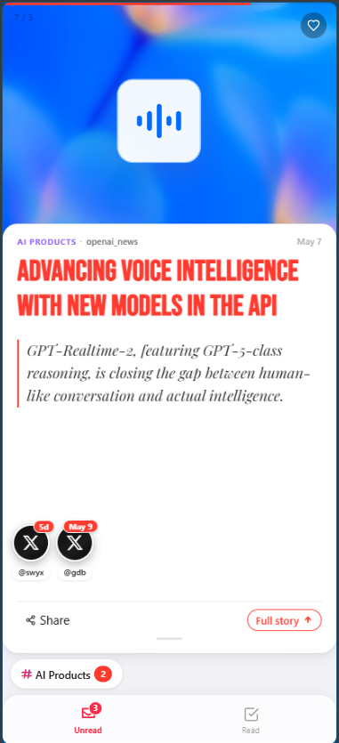
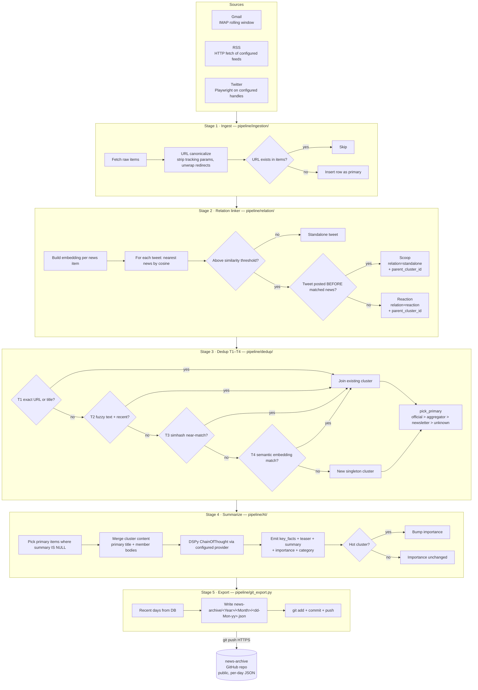

<h1>syndicate</h1>

  <b>Personal AI news archiver.</b> Runs on your laptop, summarizes with a
  local model, stores and serves through Git. Zero monthly cost.

  
  
  
  
  
  

  <code>/plugin marketplace add aadarshvelu/syndicate</code>
  &nbsp;·&nbsp;
  <code>/plugin install syndicate-pipeline@syndicate</code>

 

> Every morning I'd open Gmail, scroll Twitter, hop over to Hacker News —
> and somehow read the same OpenAI announcement over and over while missing
> the small Anthropic update that actually mattered. Tabs full of the same
> story, none of the signal.
>
> Syndicate is the fix.

---

## 👋 Why this exists

The constraint that shaped the architecture was simple: **no server, no monthly bill.**
Which meant re-inventing the usual "Postgres + cron + S3 + CDN + Vercel" stack
as things I already had at home:

<table>
  <tr>
    <td>🧠</td>
    <td><b>Compute</b></td>
    <td>My laptop, on a regular schedule via <code>launchd</code>. No daemon, no always-on box. A missed cycle catches up cleanly within the rolling ingest window — longer absences lose older items.</td>
  </tr>
  <tr>
    <td>🤖</td>
    <td><b>AI</b></td>
    <td>A local small language model (Ollama-served <code>gemma4</code>) for summarization, a local embedding model for dedup. Zero API spend.</td>
  </tr>
  <tr>
    <td>📦</td>
    <td><b>Storage</b></td>
    <td>A second Git repo (<code>news-archive</code>) holds the daily JSON output. Versioned for free, no DB to host.</td>
  </tr>
  <tr>
    <td>🌐</td>
    <td><b>Hosting</b></td>
    <td>GitHub Pages serves the PWA. It fetches its data straight out of <code>news-archive</code>. No backend, no CDN bill.</td>
  </tr>
</table>

Total operational cost: electricity. Total infrastructure: my laptop and two Git repos.

---

## 🚀 Get started in 60 seconds

<table>
  <thead>
    <tr>
      <th>How to use it</th>
      <th>What you run</th>
    </tr>
  </thead>
  <tbody>
    <tr>
      <td>🧑‍💻 <b>Claude Code plugin</b> conversational, agent-driven</td>
      <td>
        <pre><code>/plugin marketplace add aadarshvelu/syndicate
/plugin install syndicate-pipeline@syndicate
/syndicate-pipeline:syndicate-status</code></pre>
      </td>
    </tr>
    <tr>
      <td>⚙️ <b>Direct CLI</b> cron-friendly text output</td>
      <td>
        <pre><code>git clone https://github.com/aadarshvelu/syndicate.git
cd syndicate &amp;&amp; uv sync
cp .env.example .env  # fill in what you need
uv run syndicate</code></pre>
      </td>
    </tr>
    <tr>
      <td>📱 <b>Read on phone/desktop</b> PWA, no install</td>
      <td>
        <a href="https://aadarshvelu.github.io/syndicate/"><b>aadarshvelu.github.io/syndicate</b></a> 
        Works offline. Add to Home Screen for native-app feel.
      </td>
    </tr>
  </tbody>
</table>

Long-form install walkthrough, env-loading mechanics, and publishing notes
live in [INSTALL.md](INSTALL.md).

---

## 📱 Read the feed

<a href="https://aadarshvelu.github.io/syndicate/"><b>aadarshvelu.github.io/syndicate</b></a>
— static React/Vite PWA on GitHub Pages. Reads per-day JSON straight
from the [news-archive](https://github.com/aadarshvelu/news-archive)
repo, caches in IndexedDB, works offline once loaded. No accounts, no
backend, no data leaves the device.

  

**Install it as a phone app** (takes 10 seconds):

<table>
  <tr>
    <td>📱 <b>iOS Safari</b></td>
    <td>Open the link → Share → <b>Add to Home Screen</b> → Add</td>
  </tr>
  <tr>
    <td>🤖 <b>Android Chrome</b></td>
    <td>Open the link → ⋮ menu → <b>Install app</b> (or <b>Add to Home screen</b>)</td>
  </tr>
  <tr>
    <td>💻 <b>Desktop Chrome / Edge</b></td>
    <td>Open the link → address-bar install icon (⊕ in the right side) → Install</td>
  </tr>
</table>

After install, the PWA launches full-screen like a native app. The
service worker caches the bundle so subsequent opens work without
network — only the day's feed JSON is fetched fresh.

---

## ✨ What it does

### 🗞️ Watches every source

Gmail newsletters, RSS feeds, and Twitter — all collected into one SQLite.
The feed list lives in [`config/`](config/). Add a source, restart the next
run, it shows up in the archive. No service to redeploy.

### 🔍 Four-tier dedup

Cross-channel duplicates collapse into clusters before summarization sees them
— exact URL → fuzzy text → simhash → semantic embedding. I only pay the LLM
once per story, not once per source. (And with a local model, even "paying
once" is near-free.)

### 🤖 Local-only AI by default

Provider is one env var (`AI_PROVIDER=ollama|anthropic|openai|gemini|minimax`).
Default is Ollama because it's free and runs locally. Swap to any
LiteLLM-supported provider with one row in
[`pipeline/AI/lm.py`](pipeline/AI/lm.py) — no other code changes.

### 📱 Static PWA frontend

A React/Vite PWA hosted on GitHub Pages reads JSON from the news-archive repo,
caches in IndexedDB, ranks by per-category preference with a 7-day decay.
Likes are weighted (reactions count half) so a viral story doesn't pollute
next week's feed.

---

## 🏗️ End-to-end pipeline

Each box is a real module under [`pipeline/`](pipeline/). Decision nodes
carry the actual thresholds used in code, not approximations.

The whole pipeline shares one SQLite at [`db/snapshot.db`](db/) and emits a
JSON envelope per stage so any agent / cron / skill can drive it. Detailed
stage docs live alongside the code:
[`pipeline/dedup/doc.md`](pipeline/dedup/doc.md),
[`pipeline/AI/doc.md`](pipeline/AI/doc.md),
[`pipeline/doc.md`](pipeline/doc.md).

---

## 🎨 The reader is intentionally lite

The frontend is a static bundle on GitHub Pages. It never talks to my
laptop — it only fetches per-day JSON files from `news-archive`, caches
them in the browser, and works offline once loaded. No backend, no
accounts, no server-side anything.

### Personalization stays on the device

Every like, every read, every swipe lives in the browser's local
storage. Nothing leaves the device. The ranking model is small enough
to explain in one paragraph:

- Each like contributes a weight toward the category and source it
  belongs to.
- Older likes decay smoothly, so a story that mattered last month
  doesn't permanently colour next week's feed.
- Reactions count at a lighter weight than primary news — a viral
  cluster with several reaction-likes shouldn't dominate the future
  feed as if they were independent signals.
- Total stored likes are capped; the oldest get evicted when new ones
  arrive, so the model can't grow unbounded.
- The final score for any unread item combines the AI's importance
  rating with the user's accumulated category and source preferences.

The result: a feed that re-orders itself around what someone actually
reads, without an account, without a recommendation server, without
their data ever leaving the browser tab.

---

## 🔌 Plugin skills

<table>
  <tbody>
    <tr>
      <td>🩺 <b>Inspection</b> auto-invocable, read-only</td>
      <td><code>status</code> · <code>heal</code></td>
    </tr>
    <tr>
      <td>📥 <b>Ingest</b> user-only, writes DB</td>
      <td><code>ingest-gmail</code> · <code>ingest-rss</code> · <code>ingest-twitter</code></td>
    </tr>
    <tr>
      <td>⚙️ <b>Process</b> user-only, writes DB</td>
      <td><code>link-relations</code> · <code>dedup</code> · <code>summarize</code></td>
    </tr>
    <tr>
      <td>📤 <b>Publish</b> user-only, external side-effects</td>
      <td><code>export</code> (git push) · <code>notify</code> (Telegram)</td>
    </tr>
    <tr>
      <td>🚀 <b>Run</b> chains all of the above</td>
      <td><code>run</code> — parity with <code>uv run syndicate</code></td>
    </tr>
  </tbody>
</table>

Side-effect skills carry `disable-model-invocation: true`, so Claude won't
fire them by accident. You invoke them explicitly. See
[INSTALL.md](INSTALL.md) for the per-skill env requirements.

---

## ⚠️ Honest limitations

- **It's local.** Skills read your `.env`, write to local SQLite, and talk to
  Ollama on `localhost`. Claude Code reaches all of those. Claude's chat web
  app can't — that runtime is sandboxed off from your machine.
- **Twitter scraping is fragile.** Playwright + a persistent Chrome profile.
  When X.com changes its DOM, the selectors break and I update them. Skip
  Twitter if you don't want that maintenance.
- **Tuned for my reading.** Categories, importance heuristics, and the feed
  list reflect what I want to see. Easy to retune — see the category enum in
  [`pipeline/AI/`](pipeline/AI/).

---

## 🤝 Contributing

Issues and PRs welcome. Module-level docs live next to the code:
[`pipeline/*/doc.md`](pipeline/). Start there before editing — they describe
what each module is and isn't responsible for.

## 📝 License

[MIT](LICENSE). Copyright (c) 2026 Aadarsh Velu.
