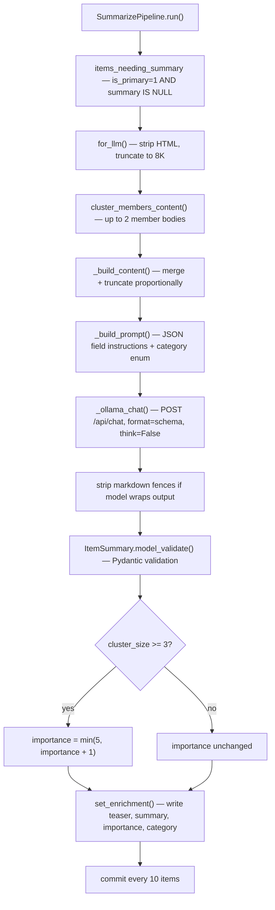

# AI

LLM enrichment — generates teaser, summary, importance, and category for each primary item.

## Flow



## Why `key_facts` is first in the schema

The model must enumerate up to 8 verbatim facts (names, numbers, dates, key claims) before writing prose. This acts as a chain-of-thought anchor — grounding the teaser and summary in extracted facts rather than hallucinated ones. Every fact from `key_facts` must appear in the summary.

## Output schema

| Field | Constraint | Purpose |
|-------|-----------|---------|
| `key_facts` | list[str], max 8 | CoT grounding step |
| `teaser` | ≤150 chars | Hook shown on card face in PWA |
| `summary` | ≤450 chars | Full story, inverted pyramid |
| `importance` | int 1–5 | 5 = major breaking news, 1 = routine |
| `category` | enum | Filter/browse in PWA |

## Categories

`ai_research` · `ai_products` · `economics` · `policy` · `startup` · `world_news` · `tech_news` · `other`

## Model

Provider and model are provider-agnostic, configured via env:

  AI_PROVIDER       ollama (default) | anthropic | openai | gemini | minimax
  SUMMARIZE_MODEL   provider-native model name (no prefix). Falls back to a
                    sensible per-provider default if unset.

Per-provider creds (only the one matching AI_PROVIDER is read):

  OLLAMA_HOST       default http://localhost:11434
  ANTHROPIC_API_KEY · OPENAI_API_KEY · GEMINI_API_KEY · MINIMAX_API_KEY

Under the hood `pipeline/AI/lm.py` constructs a `<litellm-prefix>/<model>`
string and hands it to `dspy.LM`. To add a new LiteLLM-supported provider,
add a row to `_PROVIDERS` in that file. The `--model` CLI flag overrides
`SUMMARIZE_MODEL` for one run.

## Entrypoint

```bash
uv run python -m pipeline.AI.summarize_pipeline --limit 50
uv run python -m pipeline.AI.summarize_pipeline --limit 5 --model qwen3.5:9b
```
