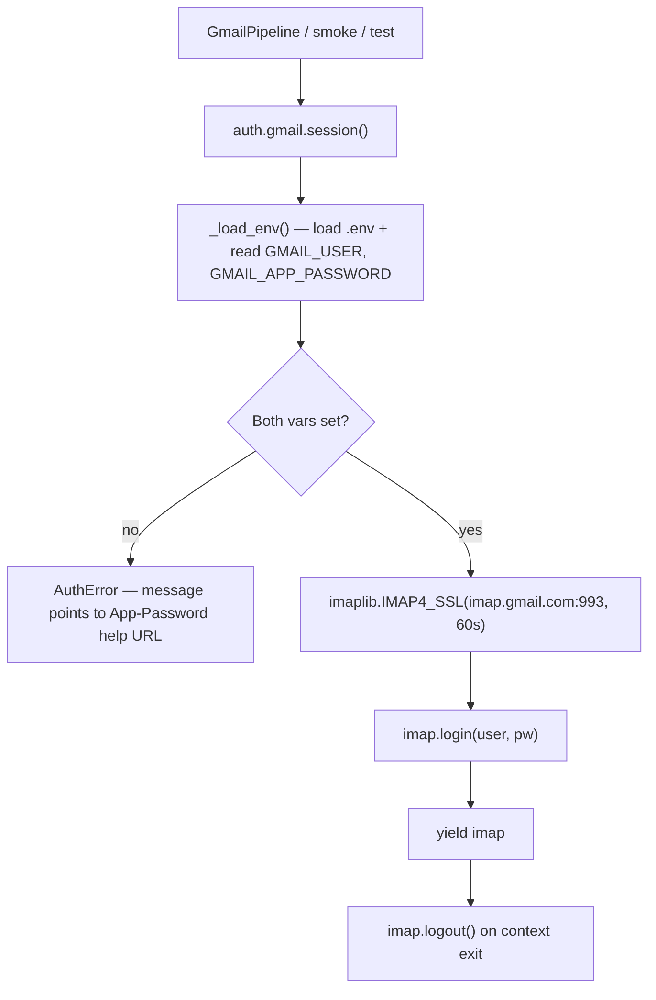

# auth

Authentication helpers for upstream services. Today there's only one —
Gmail IMAP — and that's all this module does.

## gmail.py — Gmail IMAP session



## API

```python
from pipeline.auth.gmail import connect, session

# context-manager form — preferred, auto-logs out
with session() as imap:
    imap.select("INBOX")
    ...

# bare connect — caller responsible for logout
imap = connect()
```

## Env

| Var | Required | Notes |
|---|---|---|
| `GMAIL_USER` | Yes | Full Gmail address. IMAP must be enabled on the account. |
| `GMAIL_APP_PASSWORD` | Yes | App password (NOT account password). 2FA must be on. Generate at https://myaccount.google.com/apppasswords. Spaces are stripped automatically. |

`.env` is auto-loaded from the repo root by `_load_env()`, so callers
don't have to set env explicitly.

## Errors

All failures raise `AuthError` (subclass of `RuntimeError`). Categories:

- **Missing env** — `GMAIL_USER` or `GMAIL_APP_PASSWORD` unset/empty
- **Connect timeout / OSError** — network or DNS issue
- **`imaplib.IMAP4.error`** — login rejected (wrong password, app password
  not generated, IMAP disabled on the account)

The error message includes the App-Password URL so the operator can fix
without digging through docs.

## Connect timeout

`imaplib.IMAP4_SSL` is constructed with a 60s timeout. Gmail IMAP is
occasionally slow under load — this is intentionally generous. Lower it
only if you're calling from a context that needs to fail fast.

## Not in scope

- OAuth2 / XOAUTH2 — App Password is simpler for personal use. If you
  want OAuth, build a sibling helper rather than retrofitting this one.
- Mail send (SMTP) — outbound notifications go through
  [`pipeline/channel/`](../channel/), not through here.
