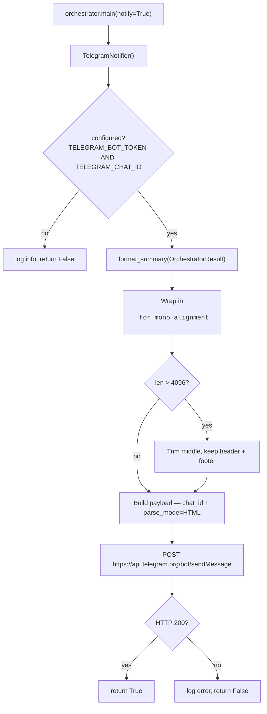

# channel

Outbound notification channels. One channel today — Telegram — used to
post a run summary at the end of each `uv run syndicate` (or
`/syndicate-run`) invocation.

## telegram.py — Telegram run notifier



## API

```python
from pipeline.channel.telegram import TelegramNotifier

# Reads env automatically:
notifier = TelegramNotifier()
if notifier.configured:
    notifier.notify(orchestrator_result)
```

Explicit construction (for tests):

```python
TelegramNotifier(token="...", chat_id="...", timeout=15).notify(result)
```

## Env

| Var | Required | Notes |
|---|---|---|
| `TELEGRAM_BOT_TOKEN` | Yes | From @BotFather. Treat as secret — anyone with it can post as your bot. |
| `TELEGRAM_CHAT_ID` | Yes | Numeric. For a personal chat with your bot, message the bot once, then `GET https://api.telegram.org/bot<TOKEN>/getUpdates` and copy `result[0].message.chat.id`. For groups, the ID is negative. |

When either var is missing, `notifier.configured` is `False` and
`notify()` is a no-op. The orchestrator never fails because Telegram is
not set up — it just doesn't post.

## Message format

The body is rendered as the same boxed summary you see on stdout
(via `format_summary` in [`pipeline/orchestrator.py`](../orchestrator.py)),
wrapped in an HTML `<pre>` block. Reasons:

- The wide `═` separators wrap badly on phones, but `<pre>` forces
  monospace and the existing 68-char width fits mobile Telegram.
- Per-stage columns stay aligned — same formatter is shared with stdout,
  so the two outputs never drift.

If the summary exceeds Telegram's 4096-char cap, the middle is trimmed.
The header (timestamp, status) and footer (per-stage tail) survive.

## Failure policy

Telegram is best-effort. Every error path returns `False`, logs the
issue, and continues. The notifier never raises — the run summary
posting must not break the pipeline.

## Not in scope

- Slack / Discord / webhook generic — write a sibling notifier class with
  the same `configured` / `notify(result) -> bool` interface and wire it
  into [`pipeline/orchestrator.py`](../orchestrator.py).
- Per-item notifications (push when a new high-importance story lands) —
  this channel is run-summary only. Per-item alerting would be a separate
  feature with its own throttling.
