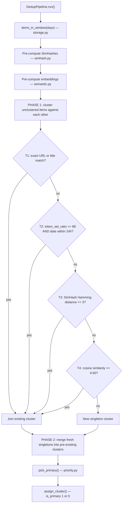

# dedup

Four-tier duplicate detection. Groups items into clusters and marks one per cluster as `is_primary=1`.

## Flow



## Two-phase design

**Phase 1** only clusters items that don't yet have a `cluster_id` against each other. Items already in a cluster from previous runs are untouched.

**Phase 2** catches the case where a fresh item should belong to a *pre-existing* cluster from an earlier run — e.g., a newsletter covering a story that was already seen in RSS the day before.

## Tier modules

| File | Role |
|------|------|
| `runner.py` | `DedupPipeline` — orchestrates all tiers + both phases |
| `canon.py` | URL canonicalization (strip tracking params, unwrap wrappers); title normalization |
| `priority.py` | `pick_primary` — official > aggregator > newsletter > unknown; tie-break on content length then date |
| `simhash.py` | 64-bit 3-gram SimHash fingerprint; Hamming distance |
| `semantic.py` | Ollama embedding via HTTP; cosine on L2-normalized vectors; blob serialize/deserialize |

## Cluster method labels

Most-specific method label wins when multiple tiers could describe a cluster:

```
singleton → preexisting → t4_semantic → t3_simhash → t2_fuzzy → t1_exact
```
