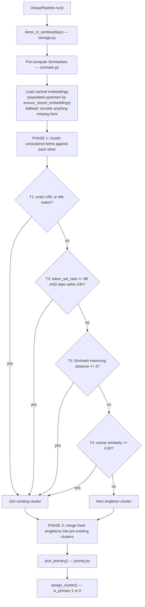

# dedup

Four-tier duplicate detection. Groups items into clusters and marks one per cluster as `is_primary=1`.

## Flow



## Two-phase design

**Phase 1** only clusters items that don't yet have a `cluster_id` against each other. Items already in a cluster from previous runs are untouched.

**Phase 2** catches the case where a fresh item should belong to a *pre-existing* cluster from an earlier run — e.g., a newsletter covering a story that was already seen in RSS the day before.

## Tier modules

| File | Role |
|------|------|
| `runner.py` | `DedupPipeline` — orchestrates all tiers + both phases |
| `canon.py` | URL canonicalization (strip tracking params, unwrap wrappers); title normalization |
| `priority.py` | `pick_primary` — official > aggregator > newsletter > unknown; tie-break on content length then date |
| `simhash.py` | 64-bit 3-gram SimHash fingerprint; Hamming distance |
| `semantic.py` | Provider-agnostic embedding via env (`EMBEDDING_PROVIDER` / `EMBEDDING_MODEL`); cosine on L2-normalized vectors; blob serialize/deserialize. Exports `ensure_recent_embeddings(store, days)` which is the public entry point used by `pipeline/main.py` before dedup runs |

## Embedding cost is paid upstream

Historically dedup encoded missing embeddings inline at the start of its
run, which routinely stretched dedup wall time to 3+ hours when many
items needed encoding. The encoding now happens in a dedicated stage —
`semantic.ensure_recent_embeddings(store, days=dedup_window)` — invoked
by [`pipeline/main.py`](../main.py) between ingest and dedup.

Benefits of pulling it out:

- Dedup steady-state wall time drops to ~1 second on a 10-day window
  with all embeddings cached.
- A failing embedding provider is now an isolated stage failure with
  its own log line — not an opaque dedup hang.
- The ensure_embeddings stage has its own `BUDGET_ENSURE_EMBEDDINGS_SEC`
  wall-clock cap (default 1800s) so it can bail gracefully on the next
  batch boundary if the provider is misbehaving.

DedupPipeline's runner still has a fallback path that encodes anything
missing at dedup-time, so the system continues to work even if the
upstream stage is skipped or fails partially. The fallback is just no
longer the primary path.

## Cluster method labels

Most-specific method label wins when multiple tiers could describe a cluster:

```
singleton → preexisting → t4_semantic → t3_simhash → t2_fuzzy → t1_exact
```
