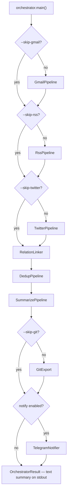

# pipeline

Top-level orchestrator, unified CLI, and shared core modules. Two entry
points — the legacy text-output `uv run syndicate` (orchestrator) and
the JSON-emitting unified CLI used by the Claude Code skills.

## Full orchestrator flow (`uv run syndicate`)



Each stage writes to SQLite ([`storage.py`](storage.py)) independently. A
failed stage is logged and skipped — subsequent stages still run against
whatever is already in the DB. Failures accumulate in
`OrchestratorResult.errors[]`.

## Unified CLI (`pipeline/cli.py`)

The Claude Code skills (and any other agent) drive stages individually
through a JSON-emitting CLI:

```bash
uv run python -m pipeline.cli status         # read-only snapshot
uv run python -m pipeline.cli health         # ollama + disk + env subset
uv run python -m pipeline.cli ingest-gmail   # --days N --folder INBOX
uv run python -m pipeline.cli ingest-rss     # --days N
uv run python -m pipeline.cli ingest-twitter # --days N
uv run python -m pipeline.cli link-relations
uv run python -m pipeline.cli dedup          # --window N --tiers 1,2,3,4
uv run python -m pipeline.cli summarize      # --limit N --model M
uv run python -m pipeline.cli export
uv run python -m pipeline.cli run            # full pipeline equivalent
```

Every subcommand emits:

```json
{"ok": bool, "result": {...stage-specific...}, "log_path": "logs/<date>.txt"}
```

`cli.py` auto-loads `.env` at import time before any pipeline module
loads, so subprocesses always see the configured credentials regardless
of the caller's environment. See [`INSTALL.md`](../INSTALL.md) for the
env-loading mechanics.

## Shared core (top-level files)

| File | Role |
|------|------|
| `cli.py` | JSON-emitting per-stage CLI used by Agent Skills |
| `clean.py` | HTML→plain-text: `to_text`, `for_embed`, `for_llm` |
| `git_export.py` | Per-day JSON writer + `git add/commit/push` to news-archive |
| `logger.py` | File logger setup (`logs/<date>.txt`), 7-day rotation |
| `main.py` | Legacy `digest` inner-pipeline entrypoint (ingest + dedup + summarize, no git/notify) |
| `orchestrator.py` | Full `uv run syndicate` driver, text summary, Telegram hook |
| `status.py` | Read-only snapshot for `/syndicate-status` and `/syndicate-heal` |
| `storage.py` | SQLite `ItemStore` — every read/write goes through here |

## Subpackages

| Package | Purpose | Doc |
|---------|---------|---|
| `ingestion/` | Pull from Gmail / RSS / Twitter, normalize to item schema | [`doc.md`](ingestion/doc.md) |
| `relation/` | Tweet ↔ news linker (reaction / scoop / standalone) | [`doc.md`](relation/doc.md) |
| `dedup/` | Four-tier duplicate detection and cluster assignment | [`doc.md`](dedup/doc.md) |
| `AI/` | LLM enrichment — teaser, summary, importance, category | [`doc.md`](AI/doc.md) |
| `channel/` | Outbound notifications (Telegram today) | [`doc.md`](channel/doc.md) |
| `auth/` | Gmail IMAP session helper | [`doc.md`](auth/doc.md) |
| `extractors/` | `From:` → `source_id` dispatcher + extractor registry | [`doc.md`](extractors/doc.md) |
| `tools/` | Dev/debug scripts — smoke, simulate, browser install | [`doc.md`](tools/doc.md) |

## Pipeline stage order — why this sequence

```
ingest → relation → dedup → summarize → export → notify
```

- **Ingest first**, obviously — nothing else has anything to do without
  fresh rows.
- **Relation BEFORE dedup**: relation needs primary news rows to link
  tweets against. But it operates on the rolling 7-day news set
  regardless of which are clustered, so it doesn't depend on dedup
  output — only on `is_primary=1`.
- **Dedup BEFORE summarize**: summarize merges cluster member content
  into one prompt, so clusters must be assigned first.
- **Export AFTER summarize**: exported JSON includes the AI-generated
  teaser/summary fields, so summarize must finish first.
- **Notify LAST**: the Telegram message recaps the full result, so
  every stage must be done.

Skipping a stage via `--skip-*` is supported and tested. The downstream
stages just get less to work on.
