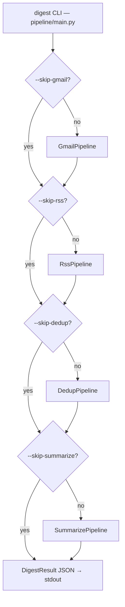

# pipeline

Top-level orchestrator and shared core modules.

## Orchestration flow

Each stage writes to SQLite (`storage.py`) independently. A failed stage is logged and skipped — subsequent stages still run against whatever is already in the DB.

## Shared core

| File | Role |
|------|------|
| `storage.py` | SQLite `ItemStore` — all DB reads/writes go through here |
| `clean.py` | HTML→plain-text: `to_text`, `for_embed`, `for_llm` |

## Subpackages

| Package | Purpose |
|---------|---------|
| `ingestion/` | Pull content from Gmail and RSS, normalize to unified schema |
| `dedup/` | Four-tier duplicate detection and cluster assignment |
| `AI/` | LLM enrichment — teaser, summary, importance, category |
| `auth/` | Gmail IMAP authentication |
| `extractors/` | Map email From: headers to `source_id` |
| `tools/` | Dev/debug scripts — simulate, smoke tests |
