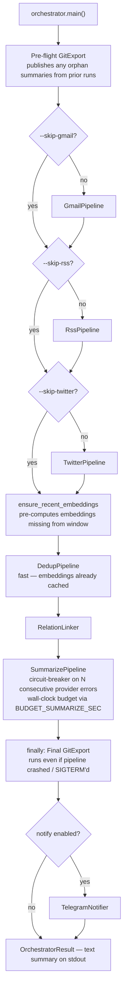

# pipeline

Top-level orchestrator, unified CLI, and shared core modules. Two entry
points — the legacy text-output `uv run syndicate` (orchestrator) and
the JSON-emitting unified CLI used by the Claude Code skills.

## Full orchestrator flow (`uv run syndicate`)



Each stage writes to SQLite ([`storage.py`](storage.py)) independently. A
failed stage is logged and skipped — subsequent stages still run against
whatever is already in the DB. Failures accumulate in
`OrchestratorResult.errors[]`.

### Resilience patterns (A–F refactor, May 2026)

Five failure modes that historically caused multi-day silent outages,
each addressed in the current orchestrator + supporting code:

| Pattern | Where | What it does |
|---|---|---|
| **Pre-flight export** | [`orchestrator.py`](orchestrator.py) | Publish orphan summaries left by the previous run's mid-flight crash, BEFORE this run starts |
| **try/finally final export** | [`orchestrator.py`](orchestrator.py) | Even if the pipeline crashes or gets SIGTERM'd mid-summarize, the final export still runs against whatever's in DB. KeyboardInterrupt is caught and logged as `interrupt_info` |
| **Ensure embeddings stage** | [`dedup/semantic.py:ensure_recent_embeddings`](dedup/semantic.py) | Runs before dedup. Catches up any items in the dedup window missing embeddings. Steady-state runs (~0 missing) complete in milliseconds. Replaces the 3-hour inline encoding that used to live inside `DedupPipeline.run()` |
| **Per-stage wall-clock budgets** | [`budget.py`](budget.py) | `BudgetWatch.for_stage("summarize" \| "ensure_embeddings")` polled between iterations. Defaults: 3600s / 1800s. Env override: `BUDGET_<STAGE>_SEC` |
| **Summarize circuit breaker** | [`AI/summarize.py`](AI/summarize.py) | 5 consecutive provider-error exceptions (`APIConnectionError`, `Timeout`, etc.) → bail, mark rest as deferred. Resets on success. Per-item parse errors (`ValueError`, bad JSON) don't trip it |
| **Standalone watchdog** | [`scripts/watchdog.py`](../scripts/watchdog.py) | Separate launchd job at 6h intervals reads `runs` table, fires Telegram alert if any channel >24h stale. Independent of orchestrator so silent failures don't escape unnoticed |

## Unified CLI (`pipeline/cli.py`)

The Claude Code skills (and any other agent) drive stages individually
through a JSON-emitting CLI:

```bash
uv run python -m pipeline.cli status         # read-only snapshot
uv run python -m pipeline.cli health         # ollama + disk + env subset
uv run python -m pipeline.cli ingest-gmail   # --days N --folder INBOX
uv run python -m pipeline.cli ingest-rss     # --days N
uv run python -m pipeline.cli ingest-twitter # --days N
uv run python -m pipeline.cli link-relations
uv run python -m pipeline.cli dedup          # --window N --tiers 1,2,3,4
uv run python -m pipeline.cli summarize      # --limit N --model M
uv run python -m pipeline.cli export
uv run python -m pipeline.cli run            # full pipeline equivalent
```

Every subcommand emits:

```json
{"ok": bool, "result": {...stage-specific...}, "log_path": "logs/<date>.txt"}
```

`cli.py` auto-loads `.env` at import time before any pipeline module
loads, so subprocesses always see the configured credentials regardless
of the caller's environment. See [`INSTALL.md`](../INSTALL.md) for the
env-loading mechanics.

## Shared core (top-level files)

| File | Role |
|------|------|
| `budget.py` | `BudgetWatch.for_stage(label)` — wall-clock budget polled between loop iterations. Env override: `BUDGET_<LABEL>_SEC`. Used by summarize + ensure_embeddings |
| `cli.py` | JSON-emitting per-stage CLI used by Agent Skills |
| `clean.py` | HTML→plain-text: `to_text`, `for_embed`, `for_llm` |
| `git_export.py` | Per-day JSON writer + `git add/commit/push` to news-archive |
| `logger.py` | File logger setup (`logs/<date>.txt`), 7-day rotation |
| `main.py` | Legacy `digest` inner-pipeline entrypoint. Now also wires the ensure_embeddings stage between ingest and dedup |
| `orchestrator.py` | Full `uv run syndicate` driver. Pre-flight + try/finally final export, Telegram hook, KeyboardInterrupt-safe |
| `status.py` | Read-only snapshot for `/syndicate-status` and `/syndicate-heal` |
| `storage.py` | SQLite `ItemStore` — every read/write goes through here |

## Subpackages

| Package | Purpose | Doc |
|---------|---------|---|
| `ingestion/` | Pull from Gmail / RSS / Twitter, normalize to item schema | [`doc.md`](ingestion/doc.md) |
| `relation/` | Tweet ↔ news linker (reaction / scoop / standalone) | [`doc.md`](relation/doc.md) |
| `dedup/` | Four-tier duplicate detection and cluster assignment | [`doc.md`](dedup/doc.md) |
| `AI/` | LLM enrichment — teaser, summary, importance, category | [`doc.md`](AI/doc.md) |
| `channel/` | Outbound notifications (Telegram today) | [`doc.md`](channel/doc.md) |
| `auth/` | Gmail IMAP session helper | [`doc.md`](auth/doc.md) |
| `extractors/` | `From:` → `source_id` dispatcher + extractor registry | [`doc.md`](extractors/doc.md) |
| `tools/` | Dev/debug scripts — smoke, simulate, browser install | [`doc.md`](tools/doc.md) |

## Pipeline stage order — why this sequence

```
[pre-flight export] → ingest → ensure_embeddings → dedup → relation → summarize → [final export] → notify
```

- **Pre-flight export FIRST**: publishes any orphaned summaries the
  previous run left behind. If yesterday's run died after summarize but
  before export, this publishes them so the PWA stops showing stale data.
- **Ingest second** — nothing else has anything to do without fresh
  rows.
- **ensure_embeddings BEFORE dedup**: pre-computes any embeddings the
  dedup window will need. Pulling this out of dedup means dedup wall
  time becomes ~1 second instead of the historical 3+ hours, and an
  embedding-provider failure no longer takes down dedup (which can fall
  back to clustering on T1/T2/T3 alone).
- **Dedup BEFORE relation**: relation linker needs final cluster_ids so
  reaction-tweet → news-cluster pointers stay stable across future runs.
- **Dedup BEFORE summarize**: summarize merges cluster member content
  into one prompt, so clusters must be assigned first.
- **Final export AFTER summarize**: exported JSON includes the AI-
  generated teaser/summary fields, so summarize must finish first.
  Wrapped in try/finally so it runs even if summarize crashed.
- **Notify LAST**: the Telegram message recaps the full result.

Skipping a stage via `--skip-*` is supported and tested. The downstream
stages just get less to work on.
