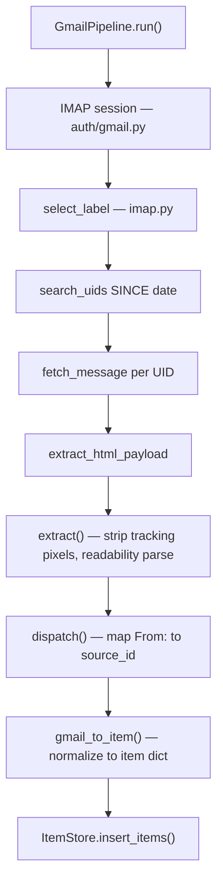
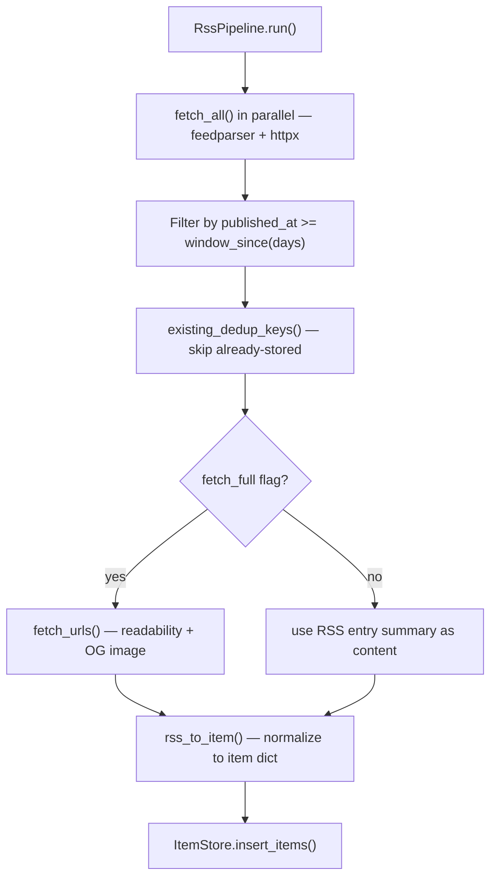

# ingestion

Pulls content from Gmail and RSS, normalizes everything to the unified item schema, persists to SQLite.

## Gmail flow



**Pre-filter:** Empty payloads (no title and no text) are dropped before DB insert.

## RSS flow



**Pre-filter:** Items with no content and no summary are dropped (`rss_to_item` returns `None`).

## Modules

| File | Role |
|------|------|
| `gmail.py` | `GmailPipeline` — IMAP ingestion runner |
| `rss.py` | `RssPipeline` — RSS ingestion runner |
| `imap.py` | Low-level IMAP ops: select, search, fetch, decode headers |
| `feeds.py` | Async RSS fetch via feedparser + httpx; date windowing |
| `fetch.py` | Async per-URL article fetcher; readability extraction; OG image |
| `normalize.py` | `gmail_to_item`, `rss_to_item` → unified item dict |
| `extract_email.py` | Email HTML cleaner: tracking pixel strip, unsub block removal, readability |
| `sources.py` | Load Gmail source registry from `config/sources.json` |

## Unified item schema

```
id              UUIDv4
dedup_key       SHA1(url) or SHA1(msgid|title)
source_id       stable identifier for the sender/feed
source_channel  "gmail" | "rss"
title           article/email subject
desp            RSS teaser (empty for Gmail)
date            published ISO8601 UTC
content         pre-cleaned plain text (is_html=0 on all new rows)
url             canonical article URL
author          sender display name or byline
fetched_at      pipeline run time ISO8601 UTC
raw_meta        JSON blob of channel-specific metadata
image_url       OG/Twitter card image (RSS only)
```
