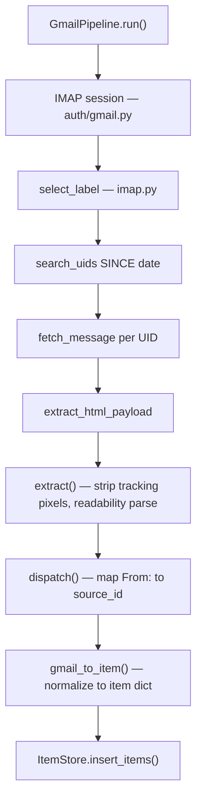
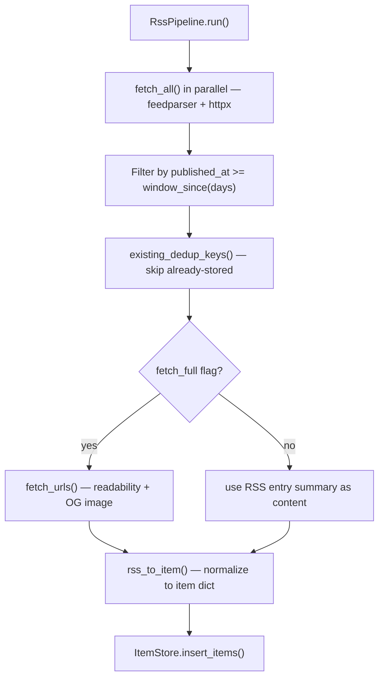
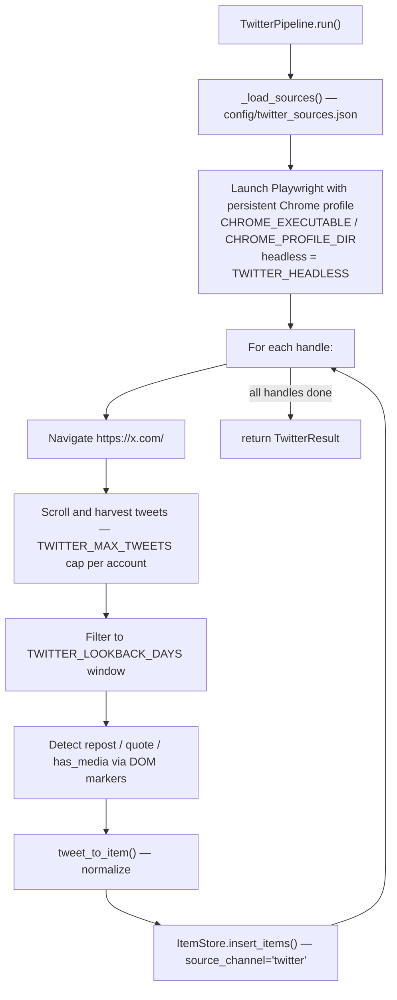

# ingestion

Pulls content from Gmail, RSS, and Twitter, normalizes everything to
the unified item schema, persists to SQLite.

## Gmail flow



**Pre-filter:** Empty payloads (no title and no text) are dropped before DB insert.

## RSS flow



**Pre-filter:** Items with no content and no summary are dropped (`rss_to_item` returns `None`).

## Twitter flow



**Persistence:** Uses a persistent user data dir (`CHROME_PROFILE_DIR`)
so the X.com session cookie survives across runs. First-time setup:
`bash scripts/setup_agent.sh` opens Chrome non-headless so you can log
in once.

**Pre-filter:** Empty tweet bodies are dropped. Pure media-only tweets
without text are normalized with an empty `content` and the
`raw_meta.has_media=true` flag set.

## Modules

| File | Role |
|------|------|
| `gmail.py` | `GmailPipeline` — IMAP ingestion runner |
| `rss.py` | `RssPipeline` — RSS ingestion runner |
| `twitter.py` | `TwitterPipeline` — Playwright-driven X.com scraper |
| `imap.py` | Low-level IMAP ops: select, search, fetch, decode headers |
| `feeds.py` | Async RSS fetch via feedparser + httpx; date windowing |
| `fetch.py` | Async per-URL article fetcher; readability extraction; OG image |
| `normalize.py` | `gmail_to_item`, `rss_to_item`, `tweet_to_item` → unified item dict |
| `extract_email.py` | Email HTML cleaner: tracking pixel strip, unsub block removal, readability |
| `sources.py` | Load Gmail / Twitter source registries from `config/*.json` |

## Unified item schema

```
id              UUIDv4
dedup_key       SHA1(url) or SHA1(msgid|title) or SHA1(tweet_id)
source_id       stable identifier for the sender/feed/handle
source_channel  "gmail" | "rss" | "twitter"
title           article/email subject (empty for tweets)
desp            RSS teaser (empty for Gmail/Twitter)
date            published ISO8601 UTC
content         pre-cleaned plain text (is_html=0 on all new rows)
url             canonical article URL or tweet permalink
author          sender display name / byline / @handle
fetched_at      pipeline run time ISO8601 UTC
raw_meta        JSON blob of channel-specific metadata
                  (RSS: og:image, Twitter: is_repost/is_quote/has_media)
image_url       OG/Twitter card image (RSS), media URL (Twitter)
```
