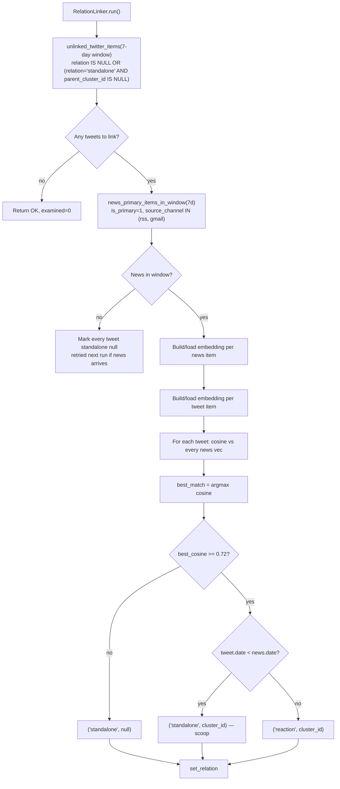

# relation

Links tweets to news clusters by embedding similarity. Runs AFTER dedup
(so news clusters are stable) and BEFORE summarize (so the summarizer
can use parent context). Produces one of three states per tweet:

| `relation` | `parent_cluster_id` | Meaning |
|---|---|---|
| `"reaction"` | `<cluster_id>` | Tweet posted **after** matching news → reacts to it |
| `"standalone"` | `<cluster_id>` | Tweet posted **before** matching news → scoop |
| `"standalone"` | `null` | No close news match |

## Flow

## Why cluster_id, not item id

The matched news is referenced by its **cluster_id**, not the row id.
Cluster ids are immutable once persisted — even when the primary item
inside a cluster shifts on future runs (e.g. an official source arrives
late and demotes a newsletter), the tweet's link still points at the
right cluster. Item ids would dangle.

## Two cohorts, no flip-flop

The linker re-examines two cohorts only:

1. **Brand-new tweets** — `relation IS NULL`
2. **Orphaned standalones** — `relation='standalone' AND parent_cluster_id IS NULL`

Tweets that already have a `parent_cluster_id` (either reaction or
scoop) are **never** reconsidered. This guarantees no flip-flop when
embeddings or news arrival order shift over time. The linking is
sticky.

The orphan cohort exists so that if a tweet was scraped before its
matching news was ingested, the next run promotes it from "naked
standalone" to "scoop" (or "reaction") once the news lands.

## Thresholds and windows

| Constant | Value | Why |
|---|---|---|
| `SIMILARITY_THRESHOLD` | `0.72` | Higher than T4 dedup (0.60) — we want strong topical match, not loose family resemblance. Empirically separates "Sam Altman quote-tweeting the launch" from "any tech tweet that day". |
| `LINK_WINDOW_DAYS` | `7` | News older than a week is unlikely to match a fresh tweet's topic. Bounds the cosine grid size. |

## Embeddings reused

Both tweets and news items use the same embedding pipeline as
[`pipeline/dedup/semantic.py`](../dedup/semantic.py). If a news item
was already embedded by dedup (T4), the vector is reused — relation
linking is mostly free in CPU/GPU time, just an extra cosine grid pass.

Embedding generation is batched (8 at a time) to bound memory on first
runs against a large backlog.

## Failure modes

- **Embedding provider down** — the tweet is left with no relation set.
  Next run will pick it up via the "unlinked" cohort. Logged at warning.
- **No primary news in window** — every tweet gets marked
  `('standalone', null)`. Next run will re-examine them as orphans.

## Module layout

| File | Role |
|---|---|
| `linker.py` | `RelationLinker.run()` — single entrypoint, batches I/O |

Embedding logic lives in [`pipeline/dedup/semantic.py`](../dedup/semantic.py).
Storage queries live in [`pipeline/storage.py`](../storage.py)
(`unlinked_twitter_items`, `news_primary_items_in_window`, `set_relation`).
