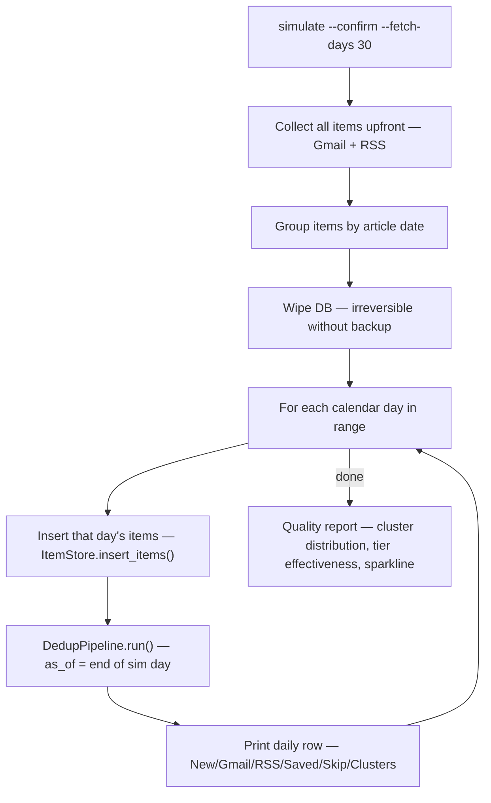

# tools

Dev and debug scripts. None write to production state without explicit confirmation.

## simulate.py — day-by-day pipeline replay



**Why collect first, then wipe?** All data is pulled from live sources before the DB is cleared. The replay inserts items one day at a time to simulate how the pipeline would behave in production with a rolling window.

**`as_of` anchor:** Without it, early sim days (e.g. 30 days ago) fall outside the live 10-day dedup window and report 0 examined. `as_of = end of sim day` makes the window relative to the simulated date.

## smoke.py — IMAP connection check

Connects to Gmail IMAP, searches recent UIDs, prints headers. No extraction, no DB writes. Use to verify auth and connectivity before running the full Gmail pipeline.

```bash
uv run python -m pipeline.tools.smoke --folder INBOX --days 3 --limit 20
```

## smoke_rss.py — RSS feed check

Fetches all feeds in `config/rss_sources.json`, optionally follows article URLs via readability. Prints entries with body previews. No DB writes. Use to verify feed URLs and `fetch_full` config.

```bash
uv run python -m pipeline.tools.smoke_rss --limit 3 -v
uv run python -m pipeline.tools.smoke_rss --no-fetch
```
